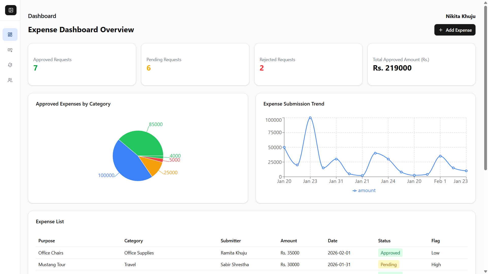
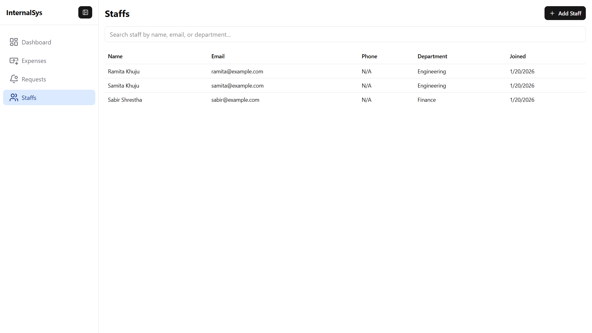
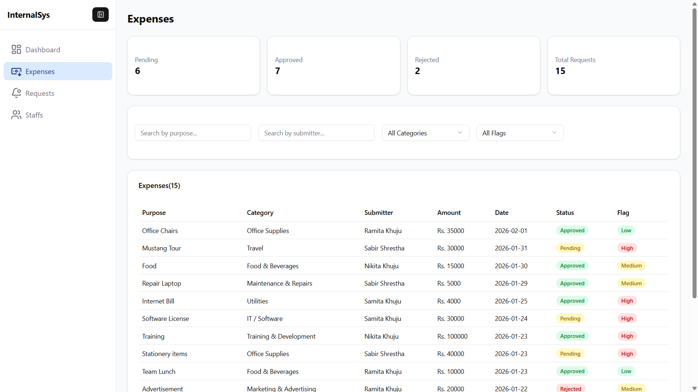
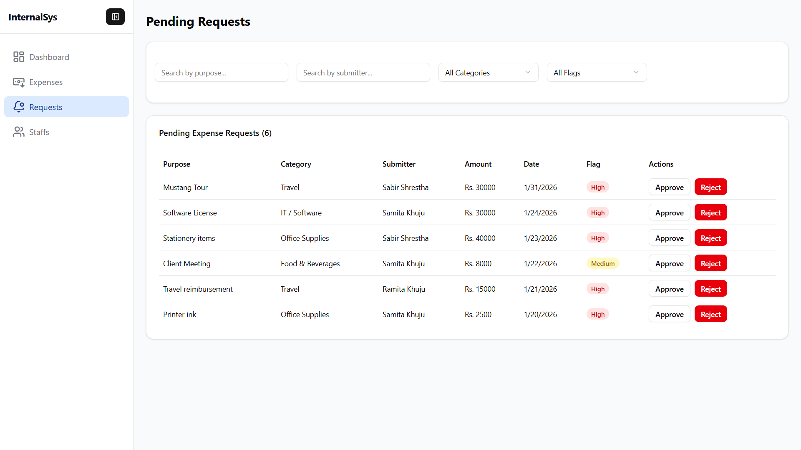
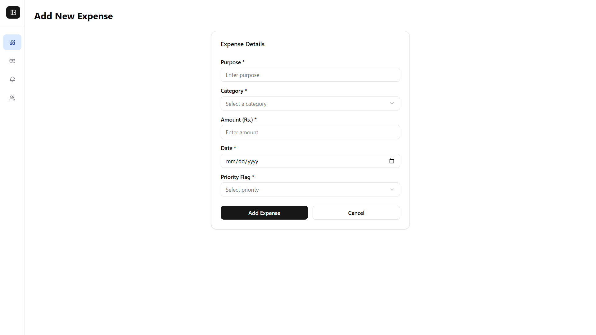
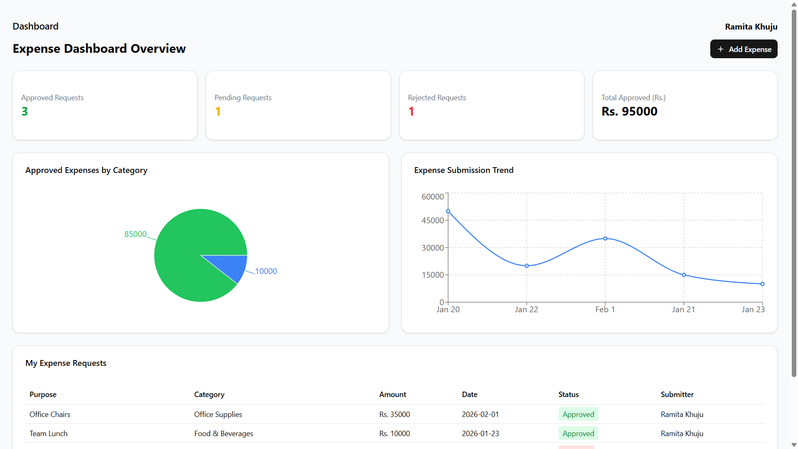

# Internal Expense System

The Internal Expense System is a web-based application designed to manage internal expense requests within a small organization. It provides a clear separation of roles and allows controlled handling of expense records through an Admin and Staff workflow.

The system is divided into two main parts:
- A client application for user interaction
- A server application for processing requests and managing data
  
## User Roles

The system supports two types of users:

### Admin

The Admin is responsible for managing staff and overseeing all expenses.

Admin capabilities include:
- Registering new staff users
- Viewing all registered staff members
- Adding expense records
- Viewing all expense records in the system
- Viewing all requested expenses
- Approving expense requests
- Rejecting expense requests
- Updating the status of expenses
- The Admin is registered in the database

### Staff

Staff users have limited access and can only manage their own expenses.

Staff capabilities include:
- Logging into the system
- Adding new expense requests
- Viewing only their own submitted expenses
- Tracking the status of their expense requests

## Features

- Role-based access for Admin and Staff
- Staff registration handled by Admin
- Expense submission and approval workflow
- Expense status management (approved or rejected)
- Clear separation between frontend and backend
- Simple and structured user interface

## Technology Overview

- Frontend: JavaScript / TypeScript with a modern UI framework using MVVM architecture
- Styling: TailwindCSS , Shadcn
- Backend: Node.js  
- API communication: HTTP requests between client and server  

(Specific dependencies can be found in the respective `package.json` files.)

## Prerequisites

Make sure the following are installed on your system:

- Node.js (latest stable version recommended)
- npm 

## Installation and Setup

### 1. Clone the repository

```sh
git clone https://github.com/NikitaKhuju/internal-expense-system.git
cd internal-expense-system
```

### 2. Setup the client
```sh
cd client
npm install
npm run dev
```
This will start the client application and open it in your browser.

### 3. Set up the server

Open a new terminal window:
```sh
cd server
npm install
node server.js
```

The server will start and listen for requests from the client.
## System Flow
1. The Admin registers staff users.
2. Staff logs in and submits expense requests.
3. Expense requests are sent to the server.
4. The Admin reviews all submitted expenses.
5. The Admin approves or rejects expense requests.
6. Staff can view the updated status of their own expenses.
This flow ensures controlled access and proper tracking of expense approvals.


## Screenshots
### Admin Dashboard

### Staffs List


### Add Staff Form

### Expenses List

### Requests List

### Add Expense Form


### Staff Dashboard



